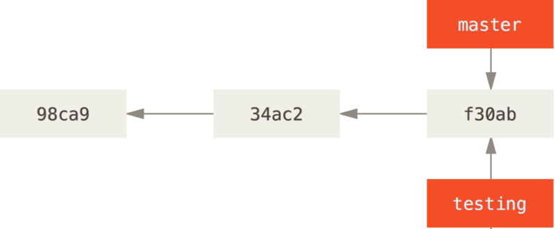
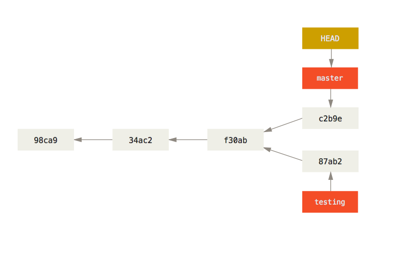

class: center, middle
# Version control with Git
*January 2017*

Daan van Vugt<sup>1</sup>, Guido Huijsmans

.footnote[<sup>1</sup> <daanvanvugt@gmail.com>]

---

# What is version control?
.xx-large[
* Track files over time
* Go back to working versions when you make a mistake
* You have probably used a basic version yourself:
  * Files like `report4.tex`, `plot_q.old.m` etc.
  * Google drive, Dropbox
]
---
# Properties of a _proper_ version control system
.xx-large[
* Backup and restore
* Synchronization
* Short-term undo
* Long-term undo
* Track changes
* Track ownership
* Sandboxing / branches
]

---

# What is Git?
.xx-large[
* Git is a content tracker
* It is a collection of tools implementing
  * (Directory) tree history storage
  * Operations on this history
  * Synchronization
* This allows it to function as a version control system!
]

---

# Outline
## The design of Git
.grey[
## Basic commands
## Branching and merging
## Collaboration with Git
## Advanced stuff & extras
]

---
# Commits (snapshot of the project in time)
.xx-large[
* Versions are managed in git as _snapshots_ of your files
* These are called __commits__
* You make these manually
  * When some small feature is 'finished'
  * With a message describing the changes
]

--

## We will draw them like this:


.xx-large[
* Commit message (first commit)
* Identifier of commit (fdf4fc)
]
---
# History is a chain of commits

---
# What is stored in a commit?
.xx-large[
* A pointer to the `tree` representing the files at this time
* A pointer to the `commit` representing the previous version
* An author
* A message explaining the changes
]
--

## Example

```bash
$ git cat-file commit 86dd3a12
tree d6b5b4b680b0aba4adf0b568f0c4fd55c38d6931
parent b1375ad7e766853bb26688c176cf0264e29fc5f5
author Daan van Vugt <daanvanvugt@gmail.com> 1482404411 +0100
committer Daan van Vugt <daanvanvugt@gmail.com> 1482404411 +0100

Rename particle diagnostics, small fixes
```
---
# Blobs and trees
.xx-large[
* `blob`: Some data, like the content of a file
* `tree`: A list of `blobs` and `trees`, with names
]
.img-width-40[]

All images in this section from [https://git-scm.com/book/en/v2/Git-Internals-Git-Objects](https://git-scm.com/book/en/v2/Git-Internals-Git-Objects)

---
# Storage of blobs and trees
.xx-large[
* `Blobs` and `trees` are stored as `objects`
* Each `object` is uniquely identified by its `key` (SHA-1 header+contents)
  * Example: `83baae61804e65cc73a7201a7252750c76066a30`
  * Commits are also stored as `objects`!
  * Using the first 6 characters of this key is usually enough
]
.img-width-40[]

---
# Example set of commits (read bottom to top)
.width-40.float-right[
### Third commit
* Create `bak/test.txt` `"version 1"`

### Second commit
* Create `new.txt` `"new file"`
* Alter `test.txt` to `"version 2"`

### First commit
* Create `test.txt` `"version 1"`
]
.float-left.width-60.img-fit-width[]
---

# Summary so far
.xx-large[
* Git tracks history as a chain of commits
* All these commits together are called your `repository`
* Each commit stores
  * all files in that commit (a `tree`)
  * a commit message
  * the author
  * the commit time
  * reference to previous commits
* Any `object` in Git (`commit, tree, blob`) has a key (like fdf4fc)
]
---

# Outline
.grey[
## The design of Git
]

## Basic commands
.grey[
## Branching and merging
## Collaboration with Git
## Advanced stuff & extras
]

---
# Basic commands
### Creating a git repository - `git init, git clone`
### Prepare files for committing - `git add`
### Committing files to the repository - `git commit`
### Inspecting the repository - `git status, git log`

---
# Creating or cloning a repository
### Create a new repository in the current folder
```bash
$ git init . # Initializes a repository in the current folder (creates .git/)
```
--
### Clone an existing repository
```bash
$ git clone git@gitlab.com:Huijsmans/CP_fusion_2017.git # Create a copy
```

---
# `git add` and the staging area
.xx-large[
* Stores all changes meant to go in the following commit
* A way to review exactly what is going to be committed
]
.float-left.width-50.img-fit-width[]
--
.width-50.float-right[
```bash
$ echo "version 1" > test.txt # Create
$ git add test.txt # Stage this file
$ git commit # Commit this file
```
]
---
# `git commit`
.xx-large[
* Makes a commit out of all files you have `git add`-ed to the staging area
* Opens a text editor for you to write a commit message
  * Use `git commit -m "commit message here"` to write on console
  * (use `<ESC>:wq` to close vim)
]
---
# Intermezzo: commit messages

.img-width-80[]
---
# Intermezzo: what makes a good commit message?
.x-large[
* Describe what was changed and why
* Insert a blank line after first line
* Wrap subsequent lines at 72 characters
]

### Model commit message
```
Capitalized, short (50 chars or less) summary

More detailed explanatory text, if necessary.  Wrap it to about 72
characters or so.  In some contexts, the first line is treated as the
subject of an email and the rest of the text as the body.  The blank
line separating the summary from the body is critical (unless you omit
the body entirely); tools like rebase can get confused if you run the
two together.

Write your commit message in the imperative: "Fix bug" and not "Fixed bug"
or "Fixes bug." 

- Bullet points are okay, too
```
---

# `git status` shows:
.xx-large[
* Staged changes
  * Changes to `add`-ed files
* Unstaged changes
  * Changes in non-`add`-ed files
* Untracked files
  * Files that are in your working directory but not in the repository
]

```git
$ git status
On branch master

Initial commit

Changes to be committed:
  (use "git rm --cached <file>..." to unstage)

    new file:   test.txt
```
---

# More examples of `git status`
```git
Changes to be committed:
(use "git reset HEAD <file>..." to unstage)

new file:   newfile.md

Changes not staged for commit:
(use "git add <file>..." to update what will be committed)
(use "git checkout -- <file>..." to discard changes in working directory)

modified:   client/index.html

Untracked files:
(use "git add <file>..." to include in what will be committed)

slides.md
```

Looking at the output from this command, we can see that:

* slides.md is currently not being tracked
* client/index.html has been modified - and is not in staging
* newfile.md is staged and ready to be committed

---
# More examples of `git status` (2)
If we make another change to newfile.md, the output from `git status`
looks like:

``` {.bash}
Changes to be committed:
(use "git reset HEAD <file>..." to unstage)

new file:   newfile.md

Changes not staged for commit:
(use "git add <file>..." to update what will be committed)
(use "git checkout -- <file>..." to discard changes in working directory)

modified:   client/index.html
modified:   newfile.md

Untracked files:
(use "git add <file>..." to include in what will be committed)

slides.md
```

---

`git log`
-----
.xx-large[
* Shows information about previous commits
* Many options
  * Draw graphs
  * Filter by author
  * Filter by date
]
## Some examples:

```bash
$ git log
$ git log -3 # last N commits
$ git log --after='yesterday' # logs since yesterday
$ git log --before="2014-01-01" # logs before a date
$ git log --oneline --decorate --graph # logs with a graph for current branch
$ git log --oneline --decorate --graph --all # logs with a graph for all branches
```

---
# Recap - Basic commands
### Creating a git repository - `git init, git clone`
### Prepare files for committing - `git add`
### Committing files to the repository - `git commit`
### Inspecting the repository - `git status, git log`

---
# Outline
.grey[
## The design of Git
## Basic commands
]

## Branching and merging

.grey[
## Collaboration with Git
## Advanced stuff & extras
]

---

# Branches in Git
.xx-large[
* Before, we had a single, linear history of changes
* Git allows multiple parallel timelines, called __branches__ (red)
* This is a pointer to a commit, updated when new commits are made
* These allow us to have multiple versions of the code at the same time
]



---
# HEAD (a special pointer to the current branch)


---
# Manipulating branches
```bash
$ git branch # list branches
$ git branch testing # create branch testing
$ git branch -d testing # delete branch testing
$ git checkout testing # switch to branch testing
$ git checkout -b new_test # create a branch new_test and switch to it
```
---
# Working in branches
```bash
$ git checkout testing # go to testing branch
$ echo "test version" > test.txt # alter a file
$ git commit -am "Add simple test example" # create a commit on this branch
```

.xx-large[
* Commits advance the HEAD branch only
]
---
# Going back to the previous version
```bash
$ git checkout master
```
.xx-large[
* Change the HEAD pointer to master
* Reset the files in your working directory
]

---

# Making some other change (diverging branches)
```bash
$ echo "bugfix" > main.txt # alter a file
$ git commit -am "bugfix" # -a: add all files and commit
```


---
# Merging these changes back together
.xx-large[
* Create a new commit with __two__ parents
* Git has algorithms to merge changes within files
* Sometimes you will be asked to decide
]


```bash
$ git checkout master
$ git merge iss53
```

---
# Merge conflicts
.xx-large[
* Happen if the same lines were changed
* Resolve manually
]

```bash
$ git merge iss53
Auto-merging index.html
CONFLICT (content): Merge conflict in index.html
Automatic merge failed; fix conflicts and then commit the result.
```
--

```html
<<<<<<< HEAD:index.html
<div id="footer">contact : email.support@github.com</div>
=======
<div id="footer">
 please contact us at support@github.com
</div>
>>>>>>> iss53:index.html
```
--
```bash
$ git mergetool
```

---
# Outline
.grey[
## The design of Git
## Basic commands
## Branching and merging
]

## Collaboration with Git

.grey[
## Advanced stuff & extras
]

---
# Sharing a repository
.xx-large[
* Commonly a central server hosts a repository
* Users push new commits to this, and fetch new changes
* `git clone` sets up a `remote` called `origin` for you
* Branch `$branch` on the remote is called `remotes/origin/$branch`
  * Treated as any other branch
]
---
# Getting new changes from the server (fetch or pull)
.xx-large[
* First `fetch` new changes, updating all `remotes/origin/$branch`
* Then `merge` these new changes
]
```bash
$ git checkout master
$ git fetch # get new commits and objects from all remotes
$ git merge origin/master # remotes/ is optional
```
--

```bash
$ git pull # does a git fetch + git merge
```
---
# Pushing your changes
```bash
$ git checkout master
# do some work
$ git commit
$ git push # shorthand for git push origin master
```

.xx-large[
* This works as long as the branches have not diverged
* Otherwise you need to `fetch+merge` and `push` again
]

---
# Outline
.grey[
## The design of Git
## Basic commands
## Branching and merging
## Collaboration with Git
]

## Advanced stuff & extras

---
# Graphical interface to `git log`
.xx-large[
* `gitg` and `gitk` show logs in a nice graphical way
  * Might not be installed on your machine yet
* The GitLab site can also do this for you
]

---
# Rebase
.xx-large[
* Rewrite a part of history
* Can be used to
  * avoid merge commits
  * rewrite commit messages
  * group commits together
* `git rebase --interactive origin/master`
* Read a blog post online if you're interested
]

---
# `git bisect`
.xx-large[
* Find the place where a bug was introduced by searching history
* Takes one known good and one known bad commit, performs a binary search
* Find your mistake in O(log n) tries, usually 2-5
]

---
# `git mergetool`
.xx-large[
* Use a (graphical) interface to help merge files
* Easier and faster usually
* Options:
  * vimdiff
  * meld (gtk)
  * many more
]

---
# Configuration
### Set your name and email address (required before making commits)
```bash
git config --global user.name "Daan van Vugt"
git config --global user.email "daanvanvugt@gmail.com"
```
### Create a fancy alias for `git log`
```bash
git config --global alias.lg "log --color --graph --pretty=format:'%Cred%h%Creset \
-%C(yellow)%d%Creset %s %Cgreen(%cr)%C(bold blue)<%an>%Creset' --abbrev-commit`"
```

---

# Summary
.xx-large[
* Git stores snapshots of files in commits
* Branches allow different versions of the code to exist
* When they diverge you have to merge
* Collaboration is done through `remotes`
  * You have to `push` your changes
  * and `fetch` new ones
  * here conflicts may occur, use `git mergetool`
* More complicated things are possible, google those
]
--

## Read more

[https://github.com/pluralsight/git-internals-pdf](https://github.com/pluralsight/git-internals-pdf)
